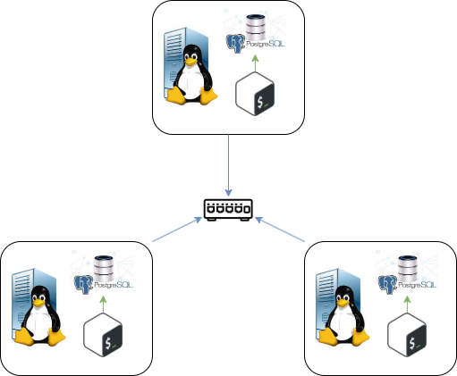

# Introduction

This project is designed to enable administrators to efficiently monitor and track CPU usage across each node within their Linux cluster. The primary goal is to ensure optimal resource allocation by providing administrators with the necessary insights to add or remove nodes based on usage data. This approach not only improves system performance but also ensures the cluster operates within its optimal capacity.

The technology stack for this project includes Bash for scripting and automation tasks, which facilitates the efficient gathering and processing of CPU usage data across the cluster. Docker is utilized specifically for setting up a PostgreSQL (psql) database, which serves as a centralized repository for storing the CPU usage data collected from each node. This setup allows for robust data management and retrieval, enabling administrators to analyze trends and make data-driven decisions. Git is employed for version control, ensuring that the development and deployment of the project are smoothly managed, with the ability to track changes and collaborate effectively.

This tailored solution is specifically aimed at administrators managing Linux clusters, offering them a streamlined and effective tool for resource management.

# Quick Start

Use markdown code block for your quick-start commands

- Start a psql instance using psql_docker.sh
- Create tables using ddl.sql
- Insert hardware specs data into the DB using host_info.sh
- Insert hardware usage data into the DB using host_usage.sh
- Crontab setup

# Implemenation

### Docker

Docker was used to provision a instance of PSQL.

### Monitoring Agent

To monitor and track the CPU usage of each node within the cluster, 2 bash scripts were created, host_info and host_usage

#### 1. host_info.sh

This bash script runs the 'lscpu' and 'vmstat' command to fetch all the hardware specs of the machine, and uses linux commands (egrep, awk) to preprocess the data before inserting it into the PSQL Database.

#### 2. host_usage.sh

This bash script runs the 'vmstat' command to fetch the current virutal memory statistics, and uses the same linux commands as above to preprocess the data before inserting it into the PSQL Database.

## Architecture



## Scripts

### `psql_docker.sh`

This script manages a Docker container running a PostgreSQL database instance. It allows the creation, starting, and stopping of the PostgreSQL container.

#### Usage

```
bash ./psql_docker.sh action [db_name] [db_password]
```

- **action**: The operation you want to perform. Options are `create`, `stop`, or `start`.
- **db_name**: The name of the database to create (required when action is `create`).
- **db_password**: The password for the database (required when action is `create`).

#### Examples

To create a new PostgreSQL container:

```bash
./psql_docker.sh create mydb mypassword
```

To start the PostgreSQL container:

```bash
./psql_docker.sh start
```

To stop the PostgreSQL container:

```bash
./psql_docker.sh stop
```

---

### `host_info.sh`

This script collects the host's hardware specifications and inserts this data into a specified PostgreSQL database. It uses the `lscpu` command to gather CPU information and other system characteristics.

#### Usage

```
bash ./host_info.sh psql_host psql_port db_name psql_user psql_password
```

- **psql_host**: The hostname or IP address of the PostgreSQL server.
- **psql_port**: The port number on which the PostgreSQL server is listening.
- **db_name**: The name of the database to insert the data into.
- **psql_user**: The PostgreSQL user with access to the database.
- **psql_password**: The password for the PostgreSQL user.

#### Example

```
bash ./host_info.sh "localhost" 5432 "host_agent" "postgres" "mypassword"
```

---

### `host_usage.sh`

This script is designed to collect the current host's usage information, including CPU and memory usage, disk I/O, etc., and then inserts this data into a specified PostgreSQL database. It uses the `vmstat` linux command to gather CPU usage information. It should be scheduled to run periodically to collect this data over time.

#### Usage

```
bash ./host_usage.sh psql_host psql_port db_name psql_user psql_password
```

Provide the same parameters as in `host_info.sh` for connecting to your PostgreSQL database.

#### Example

```
bash ./host_usage.sh "localhost" 5432 "host_agent" "postgres" "mypassword"
```

---

### Crontab Entry

To automate the execution of `host_usage.sh`, a crontab entry can be used to run the script at a scheduled interval, such as every minute.

#### Example Crontab Entry

```
# Run this to edit your crontab
crontab -e
# Include this into your crontab and exit and save
* * * * * bash /path/to/host_usage.sh "localhost" 5432 "host_agent" "postgres" "mypassword" > /tmp/host_usage.log
```

---

### `queries.sql`

This file contains SQL queries designed to answer specific business questions or to solve problems by analyzing the collected host information and usage data. It can include queries for reporting, data analysis, or maintenance tasks.

### Business Problems Addressed

- Identifying trends in system resource usage over time.
- Detecting potential system performance issues.
- Allocating resources more efficiently based on usage patterns.

Provide SQL queries tailored to analyze the data collected by `host_info.sh` and `host_usage.sh`, such as aggregating CPU and memory usage statistics over time, identifying the most heavily loaded times of day, or summarizing disk space usage trends.

## Database Modeling

### `host_info` Table Schema

| Column Name      | Data Type | Constraints           |
| ---------------- | --------- | --------------------- |
| id               | SERIAL    | NOT NULL, PRIMARY KEY |
| hostname         | VARCHAR   | NOT NULL, UNIQUE      |
| cpu_number       | INT2      | NOT NULL              |
| cpu_architecture | VARCHAR   | NOT NULL              |
| cpu_model        | VARCHAR   | NOT NULL              |
| cpu_mhz          | FLOAT8    | NOT NULL              |
| l2_cache         | INT4      | NOT NULL              |
| timestamp        | TIMESTAMP | NULL                  |
| total_mem        | INT4      | NULL                  |

### `host_usage` Table Schema

| Column Name    | Data Type | Constraints                                    |
| -------------- | --------- | ---------------------------------------------- |
| timestamp      | TIMESTAMP | NOT NULL                                       |
| host_id        | SERIAL    | NOT NULL, FOREIGN KEY REFERENCES host_info(id) |
| memory_free    | INT4      | NOT NULL                                       |
| cpu_idle       | INT2      | NOT NULL                                       |
| cpu_kernel     | INT2      | NOT NULL                                       |
| disk_io        | INT4      | NOT NULL                                       |
| disk_available | INT4      | NOT NULL                                       |

# Test

The testing was performed manually. To validate whether the it was implemented properly I compared my expected results (Manually collected), to the results that were inserted into the database. If the records matched the expected output then it is considered to have passed the test.

# Deployment

The app was deployed with the use of crontab to periodically fetch the CPU usage of each node within the cluster.

# Improvements

- Real-Time Monitoring and Alerts
- Web-Based Dashboard for Visualization
- Automated Scaling Decisions
